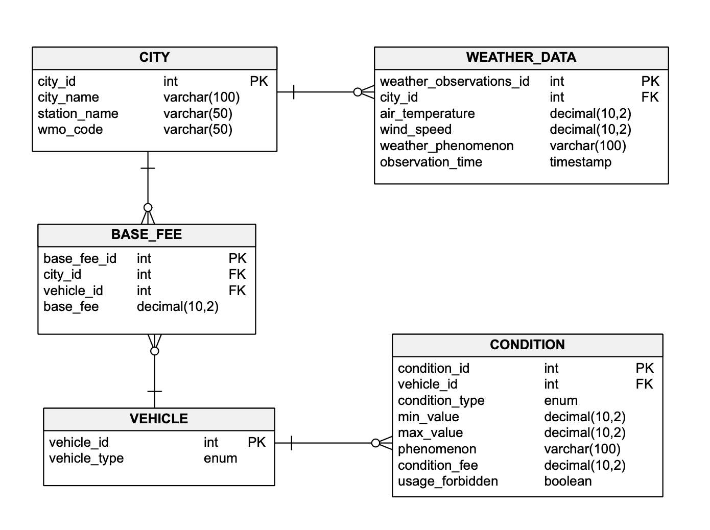

# Food Delivery API
Tha application calculates the delivery fee based on vehicle and city fee, as well as weather conditions.
It includes CRUD endpoints for managing business related logic, scheduled task that reads weather data from Estonian 
weather website and a single endpoint that returns the total delivery based on cit, vehicle and weather condition.

## Data Model
Below is the picture of the ERD Model for this application.


## Business Rules
Below you can take a closer look at how the extra fee will be calculated based on the weather condition.

| Condition Type | Vehicle (s)   | Rules                                 | Extra Fee | UsageForbidden |
|----------------|---------------|---------------------------------------|-----------|----------------|
| Temperature    | Scooter, Bike | Air temp < -10 °C                     | + 1.00    | False          |          
| Temperature    | Scooter, Bike | -10°C ≤ Air temp ≤ 0°C                | + 0.50    | False          |          
| Wind           | Bike          | -10 m/s ≤ Air temp ≤ 20 m/s           | + 0.50    | False          |          
| Wind           | Bike          | Wind > 20 m/s                         | + 0.00    | True           |          
| Phenomenon     | Scooter, Bike | Snow / Sleet (e.g. Heavy snow shower) | + 1.00    | False          |          
| Phenomenon     | Scooter, Bike | Rain (e.g. Light Rain)                | + 0.50    | False          |          
| Phenomenon     | Scooter, Bike | Glaze / Hail/ Thunder                 | + 0.00    | True           |          

Below is the fee based on city and vehicle.

| City    | CAR   | SCOOTER | Extra Fee | 
|---------|-------|---------|-----------|
| Tallinn | 4.00€ | 3.50€   | 3.00€     |          
| Tartu   | 3.50€ | 3.00€   | 2.50€     |         
| Pärnu   | 3.00€ | 2.50€   | 2.00€     |        


## Delivery Fee Endpoint
### 1. **DeliveryFeeController**
**Endpoint**: `/api/delivery-fee`  
**Method**: `GET`  
**Request Body**: `DeliveryFeeRequestDTO`  
```json
{
    "cityName": "Tallinn",
    "vehicleType": "Scooter",
    "observationTime": "2025-03-12T13:34:32" // optional
}
```

**Response Body**: `DeliveryResponseDTO`
```json
{
    "totalFee": 3.5
}
```

## Business Rules Controllers
### 1. **BaseFeeControllers**
**Endpoint**: `/api/base-fee`  
**Method**: `POST - Create`  
**Request Body**: `BaseFeeDTO`

```json
{
    "cityId": 1,
    "vehicleId": 2,
    "vehicleFee": 3.50
}
```
**Endpoint**: `/api/base-fee/{id}`  
**Method**: `PUT - Update`  
**Request Body**: `BaseFeeDTO`

```json
{
    "cityId": 1,
    "vehicleId": 2,
    "vehicleFee": 5.00
}
```
---
**Endpoint**: `/api/base-fee/{id}`  
**Method**: `GET - Get By Id`  
**Request Body**: `BaseFeeDTO`
---
**Endpoint**: `/api/base-fee`  
**Method**: `GET - Get All`  
**Request Body**: `BaseFeeDTO`
---
**Endpoint**: `/api/base-fee/{id}`  
**Method**: `DELETE - Delete`  
**Request Body**: `BaseFeeDTO`
---


